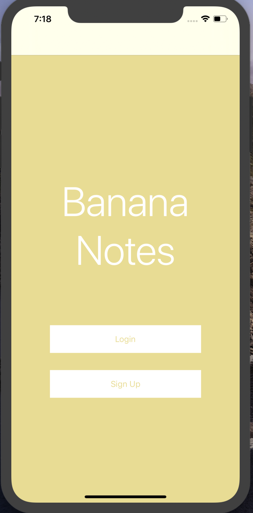
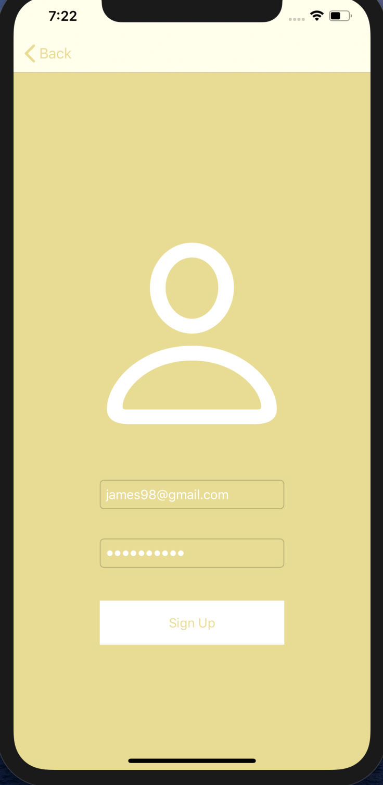
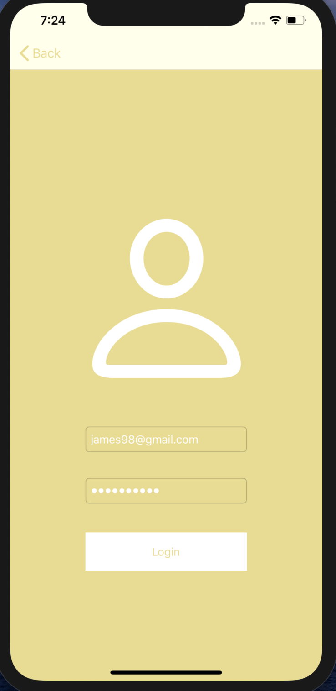
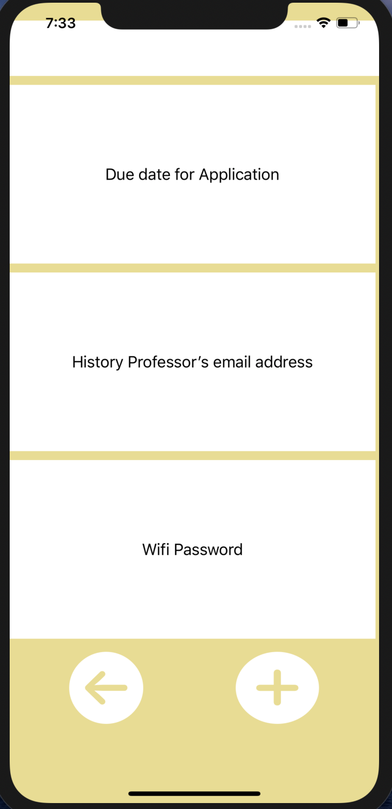
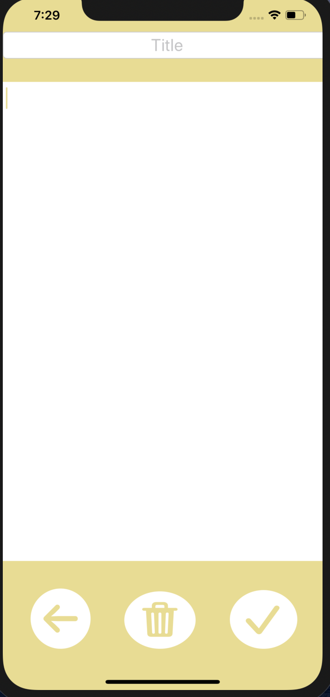
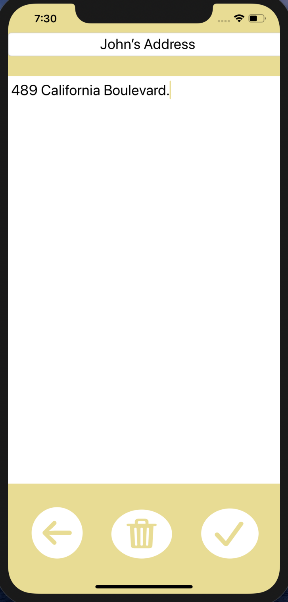

# Banana-Notes
A user authentication based note-taking application for the iOS platform. Client side code for the app is written in swift. MySQL database is being used for this project. Backend API's have been implemented using Node.js and Express.
 

